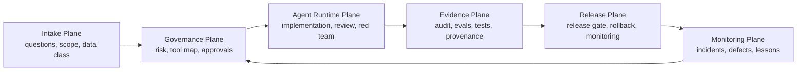

# Enterprise Target Architecture

This is the target shape for a Google-grade internal agent SDLC tool.

## Control Planes

## Repository Planes

| Plane | Folders | Purpose |
|---|---|---|
| Governance | `.agent-sdlc/`, `docs/governance/`, `templates/docs/` | Project answers, approval records, risk decisions and generated governance artefacts. |
| Agent instructions | `AGENTS.md`, `agents/`, `codex/`, `.github/copilot-instructions.md`, `.cursor/` | Consistent operating rules across human and AI coding tools. |
| Application | `app/` | Approved local implementation workspace for the fictional recruitment maps demo. |
| Assurance | `evals/`, `app/tests/`, `docs/threat-model/` | Safety evals, manual checks, accessibility checks and threat modelling. |
| Evidence | `docs/audit/`, `app/docs/`, `docs/mappings/` | Traceability, implementation notes, review evidence and control mappings. |
| Automation | `scripts/`, `.github/workflows/` | Local and CI gates for governance, evals, enterprise readiness, security and release. |

## Agent Runtime Boundary

Agents may read approved local files and run approved npm scripts. Agents may write implementation files only after `npm run governance:check` passes and only inside approved scope. Agents may not use real data, secrets, production systems, paid APIs, deployment tooling or unapproved MCP servers.

## Enterprise Upgrade Path

| Stage | Capability | Exit criteria |
|---|---|---|
| Local controlled demo | Local files, fictional data, manual evidence | Governance, eval and enterprise checks pass. |
| Team pilot | Real repository owners, protected branch, CI gates | CODEOWNERS replaced with real teams and PR evidence enforced. |
| Org platform | Central control catalog, shared policy templates, standard eval harness | Enterprise checks run in CI across project repos. |
| Regulated environment | Formal risk acceptance, security review, privacy review, audit retention | Release gate and incident response evidence are signed off by named human reviewers. |
